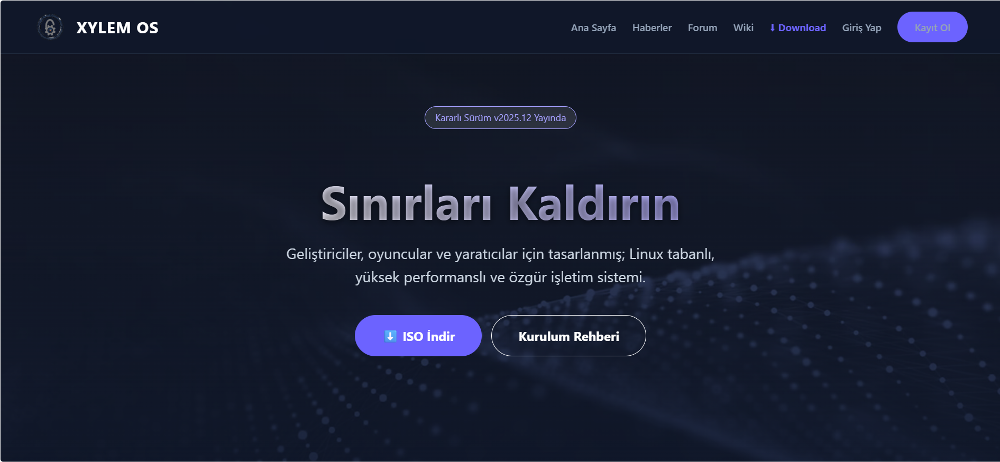
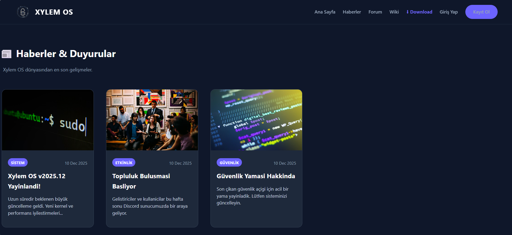
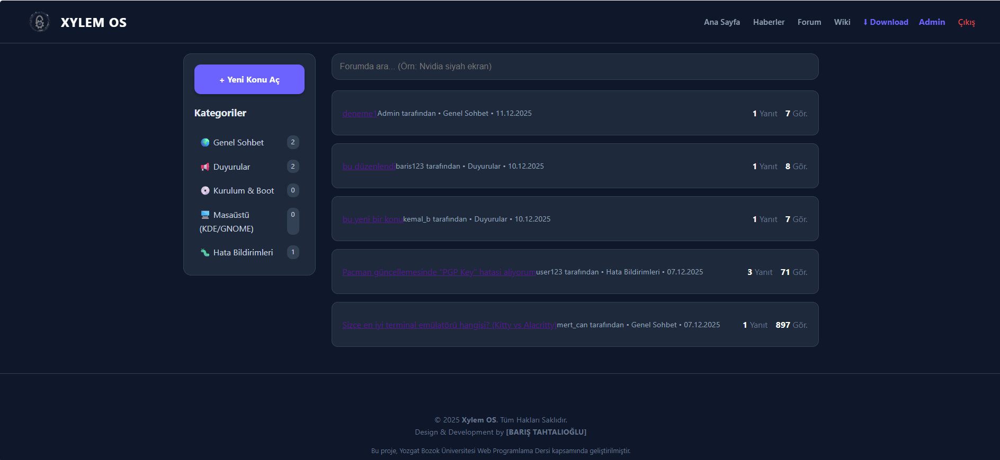
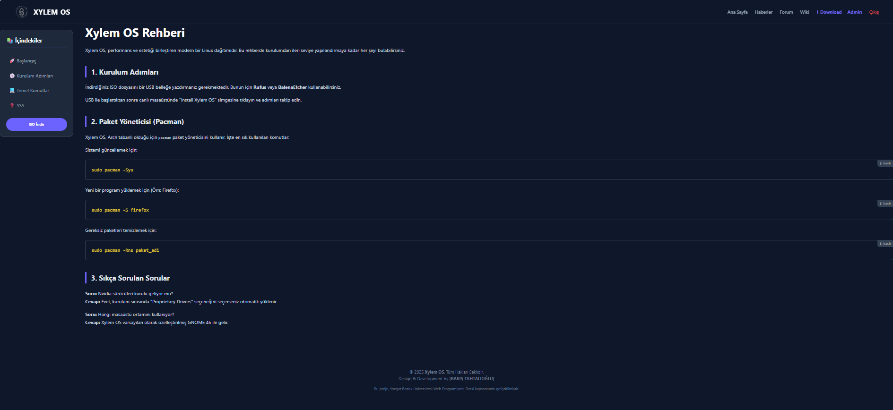
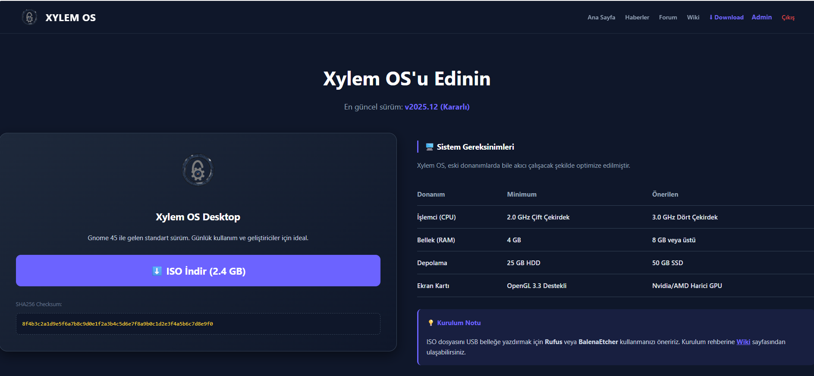
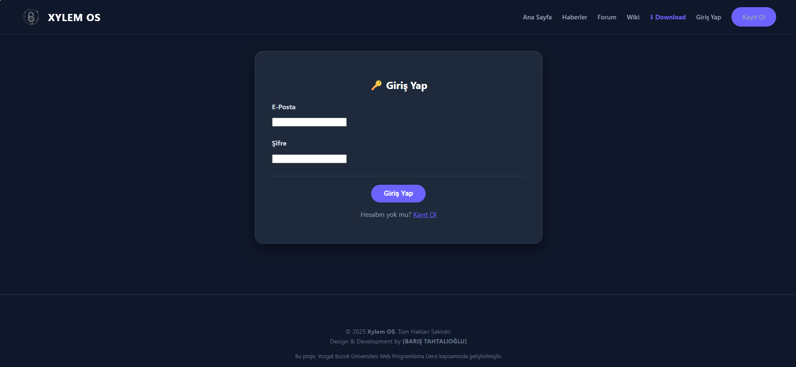

# 🌲 Xylem OS - Web Platformu


> **Yozgat Bozok Üniversitesi - Web Programlama Dersi Final Projesi**

**Xylem OS**, kurgusal bir Linux dağıtımı için geliştirilmiş; kullanıcıların işletim sistemini indirebileceği, dokümantasyonlara erişebileceği ve forum üzerinden yardımlaşabileceği dinamik bir web platformudur.

---

## 📸 Proje Ekran Görüntüleri

Projenin çalışan halinden görüntüler aşağıdadır:

### 🏠 Ana Sayfa
Modern ve responsive tasarım ile kullanıcıyı karşılayan açılış ekranı.


### 📰 Haberler & Duyurular
Admin tarafından yönetilen, grid yapısında dinamik haber sistemi.


### 💬 Forum & Topluluk
Kullanıcıların konu açabildiği, yorumlaşabildiği ve yardımlaşabildiği forum alanı.


### 📚 Wiki & Kurulum Rehberi
Kod blokları ve detaylı anlatımlarla zenginleştirilmiş dokümantasyon sayfası.


### ⬇️ İndirme (Download) Sayfası
Sistem gereksinimleri, MD5 kontrolü ve güvenli ISO indirme alanı.


### 🔑 Giriş Ekranı
Kullanıcıların hesap oluşturup sisteme dahil olabildiği arayüz.


---

## 🚀 Proje Hakkında

Bu proje, **ASP.NET Core MVC** mimarisi kullanılarak geliştirilmiştir. Modern web standartlarına uygun, güvenli ve kullanıcı dostu bir arayüz sunar. Veritabanı işlemleri için **Entity Framework Core** ve **SQL Server** kullanılmıştır.

### 🌟 Temel Özellikler

* **Forum Sistemi (CRUD):** Kullanıcılar konu açabilir, yorum yapabilir, kendi konularını düzenleyebilir ve silebilir.
* **Yetkilendirme (Auth):** Giriş yapma, Kayıt olma ve Oturum (Session) yönetimi.
* **Admin Yetkileri:** Yöneticiler tüm konuları silebilir, Haberler modülüne içerik ekleyip silebilir.
* **Güvenli Dosya İndirme:** ISO dosyaları sunucu çökmeden "Stream" yöntemiyle indirilir.
* **Güvenlik:** CSRF Koruması, SQL Injection önlemleri ve Yetki kontrolü.

---

## 💻 Kurulum ve Çalıştırma

Projeyi kendi bilgisayarınızda çalıştırmak için şu adımları izleyin:

1.  **Projeyi Klonlayın:**
    ```bash
    git clone [https://github.com/KULLANICI_ADIN/Xylem-OS.git](https://github.com/KULLANICI_ADIN/Xylem-OS.git)
    ```

2.  **Veritabanını Ayarlayın:**
    * `appsettings.json` dosyasındaki `ConnectionStrings` bölümünü kendi SQL Server ayarınıza göre düzenleyin.
    * Veritabanını oluşturmak için **Package Manager Console** üzerinden şu komutu çalıştırın (veya SQL scriptini kullanın):
    ```powershell
    Update-Database
    ```

3.  **Projeyi Çalıştırın:**
    * Visual Studio üzerinden `FluxOS.sln` dosyasını açın.
    * **Yeşil Play (Başlat)** butonuna basın.
      
---
<div align="center">
  
  **Geliştirici & Tasarımcı:** Barış Tahtalıoğlu  
  **Tarih:** Aralık 2025
  
  <br>
  
  
</div>
